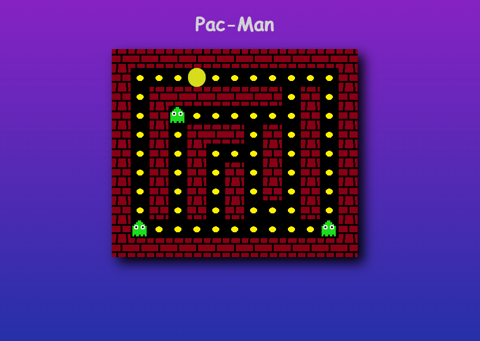

# Pac-Man

## Description

Pac-Man is an action maze chase video game; the player controls the eponymous character through an enclosed maze. The objective of the game is to eat all of the dots placed in the maze while avoiding four colored ghosts — Blinky (red), Pinky (pink), Inky (cyan), and Clyde (orange) — that pursue Pac-Man. When Pac-Man eats all of the dots, the player advances to the next level. Levels are indicated by fruit icons at the bottom of the screen. In between levels are short cutscenes featuring Pac-Man and Blinky in humorous, comical situations.

This is a version of pacman created in pure javascript using a canvas without any game frameworks.

[Try Pac-Man](https://naimur-rahman123.github.io/pacman-game/)
